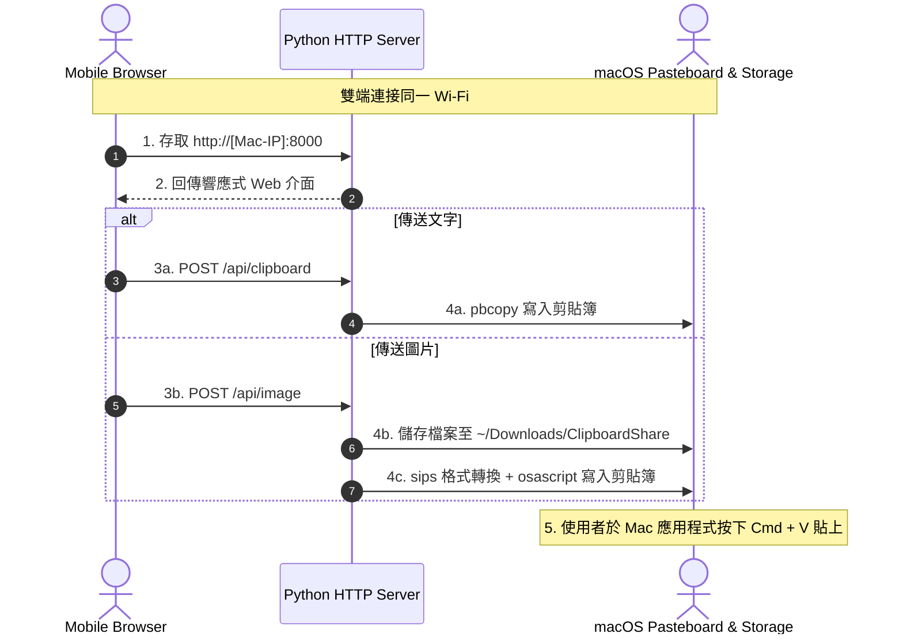

# Clipboard Share

[](LICENSE)
[](https://www.python.org/)
[](https://www.apple.com/macos/)

零依賴、純區域網路運行的跨裝置文字與圖片剪貼簿同步工具（Android / iOS ⇄ macOS）。

---

## 解決問題

* 手機（例如 Android Chrome）複製了長段文字、Token、連結或拍攝截圖，需要傳送至 Mac，但雙端未安裝共同通訊軟體（如 LINE、Telegram、Slack）。
* 避免將敏感字串或相片上傳至第三方雲端或免洗網頁圖床，確保隱私安全。
* 免裝額外 App 與 AirDrop，達成跨平台雙向秒級剪貼傳輸。

---

## 核心特性

* **零第三方套件依賴 (Zero Dependencies)**：僅使用 Python 3 標準函式庫與 macOS 內建工具（`pbcopy`、`osascript`、`sips`），無需執行 `pip install`。
* **原生剪貼簿與自動存檔**：
  * **全格式支援**：支援包含 HEIC/HEIF 等手機相片格式，伺服端自動轉檔生成高相容 Web 預覽，瀏覽器不破圖。
  * **系統級剪貼簿整合**：傳送後自動以標準全尺寸 PNG 注入 macOS 系統剪貼簿，於 Mac 任意軟體按下 `Cmd + V` 即可貼上。
  * **本機自動封存**：圖片同步儲存一份至 `~/Downloads/ClipboardShare/`。
* **文字雙向整合**：手機文字一鍵同步至 Mac `pbcopy`；手機端亦可隨時讀取 Mac 當前剪貼簿內容（`pbpaste`）。
* **QR Code 區域網路直連**：伺服器啟動時自動偵測出口 IP 並可自動於瀏覽器開啟包含連線 QR Code 之頁面，手機掃碼即入。
* **雙端自適應介面**：
  * **桌面端**：左右雙欄結構（`文字 ｜ 圖片`，接收在上、發送在下），提供圖片大圖預覽、Finder 檔案位置捷徑與常駐連線 QR Code。
  * **手機端**：垂直流結構（接收在上、發送在下），自動隱藏 QR Code 與本機 Finder 操作按鈕，介面簡潔俐落。
* **區域網路安全性**：所有數據傳輸皆為區域網路（LAN）點對點直連，不經過外部伺服器。

---

## 系統需求

* **作業系統**：macOS (系統已內建 `pbcopy`、`osascript`、`sips`)
* **執行環境**：Python 3.8 或以上版本
* **網路連線**：手機與 Mac 須連線至同一個 Wi-Fi 子網段

---

## 快速開始

### 1. 取得專案

```bash
git clone https://github.com/BolasLien/clipboard-share.git
cd clipboard-share
```

### 2. 啟動伺服器

```bash
# 基本啟動
python3 server.py

# 啟動並自動在 Mac 瀏覽器開啟頁面
python3 server.py -o
```

終端機將顯示區域網路連線資訊：
```text
============================================================
跨裝置剪貼簿同步服務 (文字 & 圖片) 已啟動
============================================================
請確保手機與 Mac 連接同一個 Wi-Fi
手機瀏覽器請開啟網址：
   http://192.168.1.56:8000
Mac 本機可開啟：
   http://localhost:8000
圖片儲存目錄：~/Downloads/ClipboardShare
============================================================
等待連線中... (按 Ctrl + C 結束服務)
```

### 3. 操作流程

1. **連線**：手機相機掃描 Mac 螢幕上的 QR Code，或於手機瀏覽器手動輸入該區域網路網址。
2. **傳送圖片**：
   * 點選相片選取區、拍照或於輸入區長按貼上截圖。
   * 點擊「傳送圖片」。
   * 切換至 Mac 任意應用程式直接按 `Cmd + V` 貼上圖片（或由手機端檢視下載）。
3. **傳送文字**：於文字框貼上文字後點擊「傳送文字」，雙端自動即時同步。

---

## 參數說明

```text
usage: server.py [-h] [-p PORT] [-o]

Cross-device Clipboard Sync (Android/iOS ⇄ macOS)

options:
  -h, --help            顯示說明訊息
  -p PORT, --port PORT  服務監聽通訊埠 (預設: 8000)
  -o, --open            啟動時自動在 Mac 瀏覽器開啟頁面
```

---

## 系統架構



---

## 貢獻指南

歡迎提交 Issue 或 Pull Request，詳細規範請參閱 [CONTRIBUTING.md](CONTRIBUTING.md)。

---

## 授權條款

本專案採用 [MIT License](LICENSE)。
