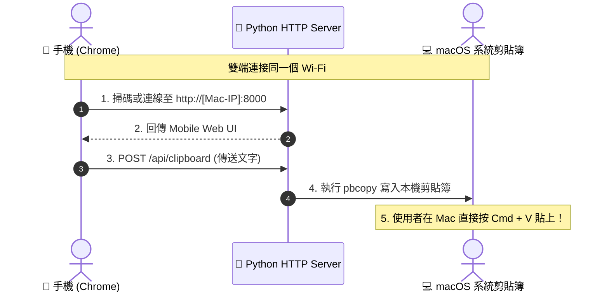

# 📋 Clipboard Share

[](LICENSE)
[](https://www.python.org/)
[](https://www.apple.com/macos/)

極簡、零依賴、純區域網路運行的跨裝置剪貼簿雙向同步工具（Android / iOS ⇄ macOS）。

---

## 🎯 解決痛點

* 手機（例如 Android Chrome）複製了長段文字、Token、連結或指令，想傳到 Mac，但雙端沒有安裝共同的通訊軟體（如 LINE、Telegram、Slack）。
* 不想為了傳送一小段文字而登入第三方雲端服務或第三方 Web 服務，避免隱私外洩。
* 不需要 AirDrop 也能實現跨平台（Android / iPhone ⇄ Mac）秒級剪貼簿傳輸。

---

## ✨ 核心特性

* 🚀 **零第三方套件 (Zero Dependencies)**：僅依賴 Python 3 內建標準函式庫，下載即跑，無需 `pip install`。
* ⚡ **原生整合剪貼簿**：
  * 手機送出文字後，Mac 端直接透過 `pbcopy` 寫入系統剪貼簿，Mac 隨處按 `Cmd + V` 即可貼上。
  * 手機亦可即時讀取 Mac 當前的剪貼簿內容（`pbpaste`），支援雙向互傳。
* 📱 **免手動輸網址**：Mac 啟動時自動偵測區域網路 IP 並可開啟瀏覽器展示 QR Code，手機相機直接掃描即可連入。
* 🔒 **區域網路隱私安全**：所有傳輸皆在自家 Wi-Fi 內網直連（Peer-to-Peer in LAN），完全不經過外部伺服器。
* 🎨 **現代化 Web 介面**：響應式設計、暗色系風格、支援自動貼上與一鍵複製。

---

## 🛠️ 系統需求

* **Mac**：macOS (已內建 `pbcopy` 與 `pbpaste`)
* **Python**：Python 3.8 或以上版本
* **網路**：手機與 Mac 必須連線至**同一個 Wi-Fi 區域網路**

---

## 🚀 快速開始

### 1. 下載專案

```bash
git clone https://github.com/BolasLien/clipboard-share.git
cd clipboard-share
```

### 2. 啟動服務

```bash
# 基礎啟動
python3 server.py

# 或者啟動並自動在 Mac 瀏覽器打開 QR Code 頁面
python3 server.py -o
```

終端機會顯示區域網路連線網址：
```text
=======================================================
🚀 剪貼簿同步服務已啟動！
=======================================================
👉 請確保手機與 Mac 連接同一個 Wi-Fi
👉 手機 Chrome 請開啟網址：
   http://192.168.1.56:8000
👉 Mac 本機可開啟：
   http://localhost:8000
=======================================================
等待傳送中... (按 Ctrl + C 可隨時結束服務)
```

### 3. 操作流程

1. **手機連線**：使用手機相機掃描 Mac 螢幕上的 QR Code，或在手機瀏覽器輸入上述網址。
2. **傳送文字**：在網頁輸入框貼上手機複製的文字，點擊 **「🚀 送到 Mac」**。
3. **在 Mac 貼上**：直接在 Mac 任何應用程式中按下 **`Cmd + V`** 即可！

---

## ⚙️ 參數說明

```text
usage: server.py [-h] [-p PORT] [-o]

Cross-device Clipboard Sync (Android/iOS ⇄ macOS)

options:
  -h, --help            顯示說明訊息
  -p PORT, --port PORT  服務監聽通訊埠 (預設: 8000)
  -o, --open            啟動時自動在 Mac 瀏覽器開啟 QR Code 頁面
```

---

## 📐 運作架構



---

## 🤝 貢獻指南

歡迎提出 Issue 或提交 Pull Request！詳細請參閱 [CONTRIBUTING.md](CONTRIBUTING.md)。

---

## 📄 授權條款

本專案採用 [MIT 授權條款](LICENSE)。
