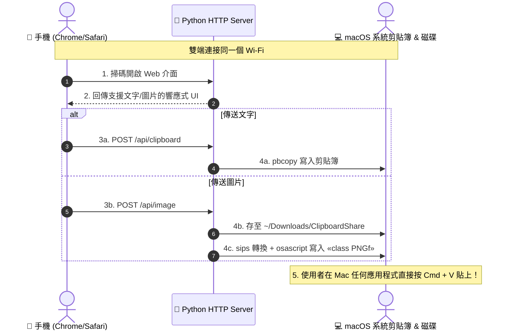

# 📋 Clipboard Share

[](LICENSE)
[](https://www.python.org/)
[](https://www.apple.com/macos/)

極簡、零依賴、純區域網路運行的跨裝置**文字 & 圖片**剪貼簿同步工具（Android / iOS ⇄ macOS）。

---

## 🎯 解決痛點

* 手機（例如 Android Chrome）複製了長段文字、Token、連結、或拍下/截圖了一張照片，想傳到 Mac，但雙端沒有共同的通訊軟體（如 LINE、Telegram、Slack）。
* 不想為了傳送一小段文字或一張照片而登入第三方雲端服務（Google Drive / Dropbox / 網頁免洗圖床），避免隱私外洩。
* 不需要 AirDrop 也能實現跨平台（Android / iPhone ⇄ Mac）秒級剪貼簿與圖片傳輸。

---

## ✨ 核心特性

* 🚀 **零第三方套件 (Zero Dependencies)**：僅依賴 Python 3 標準函式庫與 macOS 內建工具（`pbcopy`, `osascript`, `sips`），無需 `pip install`。
* 🖼️ **圖片秒傳剪貼簿 + 自動存檔**：
  * **全格式與 HEIC/HEIF 支援**：支援手機原裝相片（包含 iPhone / Samsung 的 HEIF/HEIC 格式），後端自動生成 Web-safe 預覽圖，瀏覽器絕不破圖。
  * **直接貼上圖片**：在手機或電腦網頁長按貼上截圖，或點擊拍照 / 相簿選圖。
  * **原生剪貼簿支援**：送出後 Mac 立即自動將圖片轉為標準全尺寸 PNG 寫入系統剪貼簿，隨處按下 **`Cmd + V`** 即可貼上圖片！
  * **自動封存**：圖片同步自動儲存一份至 `~/Downloads/ClipboardShare/`，方便日後找回。
* 📝 **文字原生整合**：手機送出文字後，Mac 端直接寫入剪貼簿；手機亦可即時讀取 Mac 當前的剪貼簿內容（`pbpaste`），支援雙向互傳。
* 📱 **免手動輸網址**：Mac 啟動時自動偵測區域網路 IP 並自動開啟 QR Code 網頁，手機相機直接掃描即可連入。
* 🖥️ **雙端專屬介面**：
  * **桌面端**：左右雙欄（`發送 ｜ 接收`），配備大圖預覽、Finder 資料夾捷徑與常駐 QR Code。
  * **手機端**：上下單欄（`發送 ↓ 接收`），自動隱藏 QR Code 與 Finder 按鈕，介面簡潔直覺。
* 🔒 **區域網路隱私安全**：所有傳輸皆在自家 Wi-Fi 內網直連（Peer-to-Peer in LAN），完全不經過外部伺服器。
* 🎨 **現代化 Web 介面**：暗色系質感設計、自動輪詢無縫更新、支援拖曳上傳與即時縮圖預覽。

---

## 🛠️ 系統需求

* **Mac**：macOS (內建 `pbcopy`, `osascript`, `sips`)
* **Python**：Python 3.8 或以上版本
* **網路**：手機與 Mac 必須連線至**同一個 Wi-Fi 區域網路**

---

## 🚀 快速開始

### 1. 下載專案

```bash
git clone https://github.com/BolasLien/clipboard-share.git
cd clipboard-share
```

### 2. 啟動服務

```bash
# 基礎啟動
python3 server.py

# 或者啟動並自動在 Mac 瀏覽器打開 QR Code 頁面
python3 server.py -o
```

終端機會顯示區域網路連線網址：
```text
============================================================
🚀 跨裝置剪貼簿同步服務 (文字 & 圖片) 已啟動！
============================================================
👉 請確保手機與 Mac 連接同一個 Wi-Fi
👉 手機 Chrome 請開啟網址：
   http://192.168.1.56:8000
👉 Mac 本機可開啟：
   http://localhost:8000
📁 圖片將自動存放至：~/Downloads/ClipboardShare
============================================================
等待傳送中... (按 Ctrl + C 可隨時結束服務)
```

### 3. 操作流程

1. **手機連線**：使用手機相機掃描 Mac 螢幕上的 QR Code，或在手機瀏覽器輸入上述網址。
2. **傳送圖片**：
   * 點選「📷 選擇相片、拍照或直接長按貼上」選取圖片，或在頁面直接按貼上。
   * 點擊 **「🚀 送圖片到 Mac」**。
   * 回到 Mac 任何通訊軟體、文件或繪圖軟體，直接按 **`Cmd + V`** 貼出圖片！
3. **傳送文字**：在文字輸入框貼上文字，點擊 **「🚀 送文字到 Mac」**，Mac 直接 **`Cmd + V`** 貼上。

---

## ⚙️ 參數說明

```text
usage: server.py [-h] [-p PORT] [-o]

Cross-device Clipboard Sync (Android/iOS ⇄ macOS)

options:
  -h, --help            顯示說明訊息
  -p PORT, --port PORT  服務監聽通訊埠 (預設: 8000)
  -o, --open            啟動時自動在 Mac 瀏覽器開啟 QR Code 頁面
```

---

## 📐 運作架構



---

## 🤝 貢獻指南

歡迎提出 Issue 或提交 Pull Request！詳細請參閱 [CONTRIBUTING.md](CONTRIBUTING.md)。

---

## 📄 授權條款

本專案採用 [MIT 授權條款](LICENSE)。
